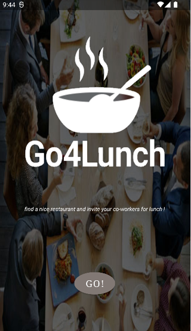

 	

# Go4Lunch
L’application Go4Lunch a pour principe d’être une application collaborative utilisée par tous les employés. Elle permet de rechercher un restaurant dans les environs, puis de sélectionner celui de son choix en en faisant part à ses collègues. De la même manière, il est possible de consulter les restaurants sélectionnés par les collègues afin de se joindre à eux. Un peu avant l’heure du déjeuner, l’application notifie les différents employés pour les inviter à rejoindre leurs collègues.

## Fonctionnalités
	* Authentification avec Gmail et Facebook via Firebase Authentification
	* Activité principale:
	* Navigation Drawer (accès à votre déjeuner du jour, paramètres de notification et de déconnexion)
	* SearchView avec saisie semi-automatique de l'API GoogleMap

 	

* 3 fragments:
	* les Restaurants, qui affiche une liste de 20 restaurants avec les heures d'ouverture complètes
	* la Carte, qui affiche une GoogleMap avec votre position et la liste des restaurants
	* les Collègues, qui affiche la liste des collègues et s'ils ont choisi un restaurant

 	
&nbsp; &nbsp; &nbsp; &nbsp;
 	
&nbsp; &nbsp; &nbsp; &nbsp;
 	

* Une activité de détails sur le restaurant qui vous permet d'appeler le restaurant, de visiter le site Web, d'ajouter aux favoris, de sélectionner ce lieu pour aujourd'hui et de voir des collègues avec le même choix
* Une activité de chat qui peut être lancée depuis les collèguesVoir
* Chaque jour, la base de données créera une collection avec la date réelle pour stocker le choix de l'utilisateur
* Le push de notification est géré avec un WorkManager, et affichera la notification juste avant la pause déjeuner

## Bibliothèque
* Conception matérielle :
	* constraint layout
	* coordinator layout
	* collapsing toolbar
* Glide
* Firebase Auth
* Firebase Firestore
* Facebook SDK
* Retrofit
* WorkManager
* Mockito
* Desugar

## Architecture
* MVVM avec une approche d'Architecture propre (viewModel, ViewState, Usecase, Repository)
* LiveData

## Dependency injection
* ViewModel factory, handmade

## Unit tests
* ViewModel et usecase 

## API
* Google Map API:
	* place nearby search
	* place details
	* place autocomplete

